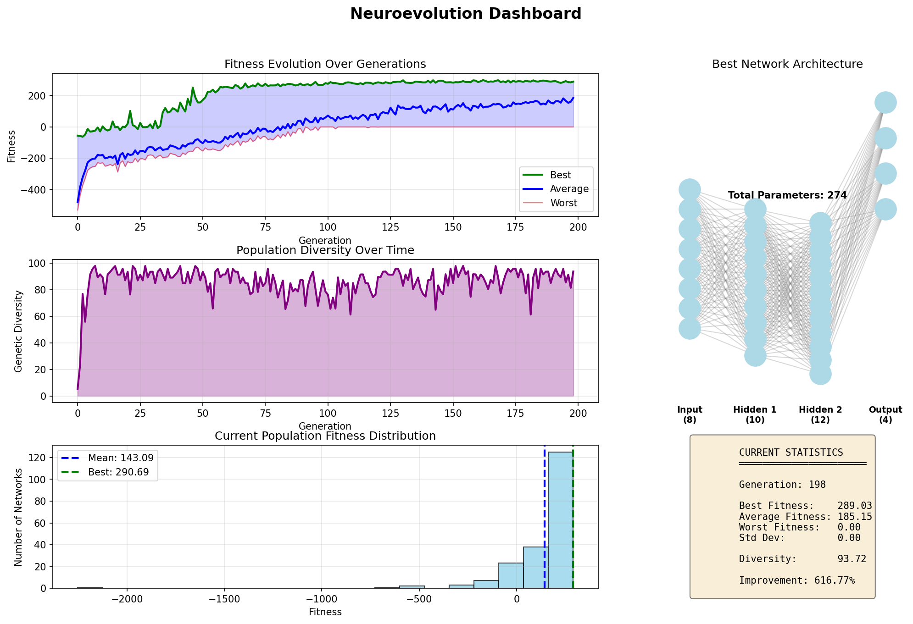

# Neuroevolution

Neural networks trained through genetic algorithms. No backprop, just natural selection.

Networks evolve over generations - the best survive, breed, and mutate. Architecture can evolve too (add/remove neurons).

Tested on CartPole and LunarLander environments.